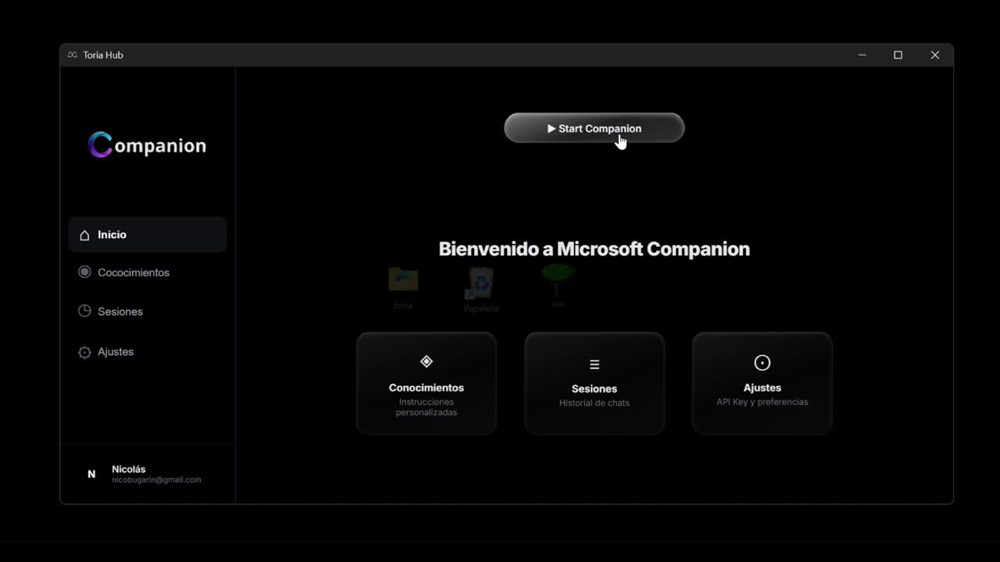
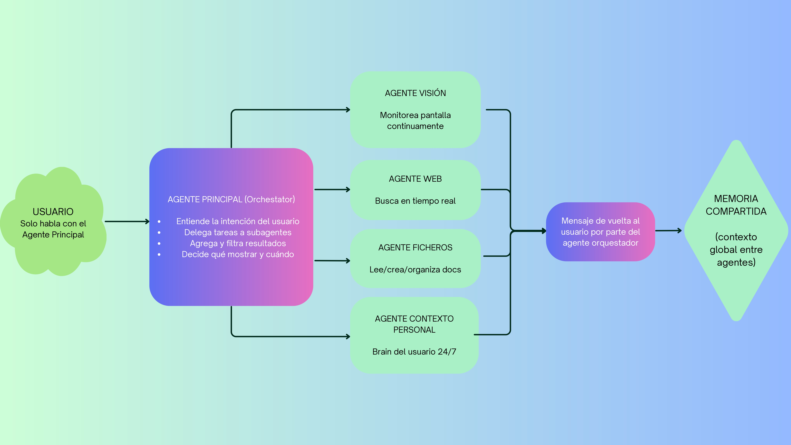
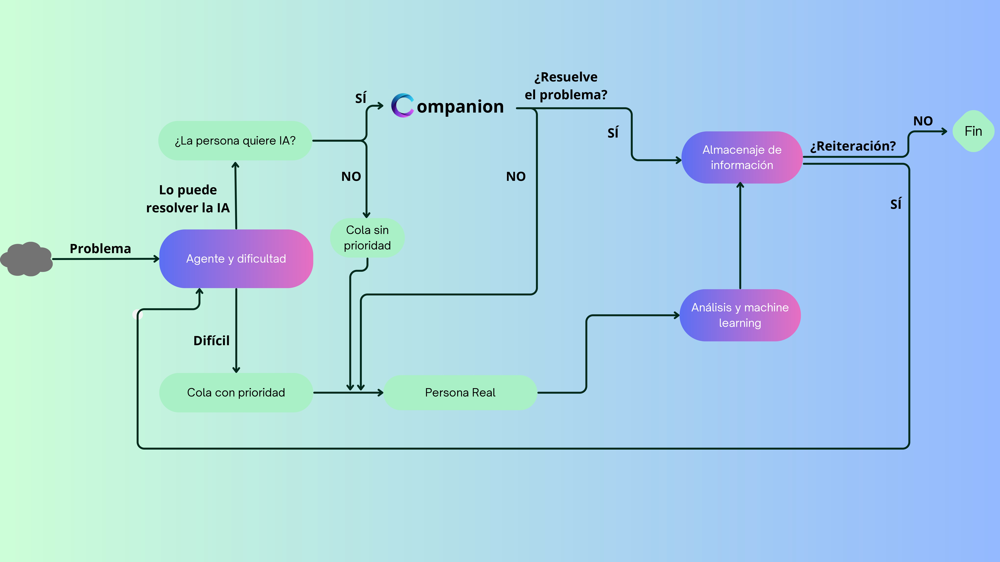

<div align="center">

# 🤖 Companion — AI Multi-Agent Assistant

**Asistente inteligente con arquitectura multi-agente orquestada**

[](https://ai.azure.com/)
[](https://openai.com/)
[](https://www.urjc.es/)

</div>

---

## 🎯 ¿Qué es Companion?

**Companion** es un asistente de inteligencia artificial con arquitectura multi-agente diseñado para apoyar a personas que necesitan atención personalizada en entornos laborales y personales complejos.

A diferencia de un chatbot tradicional, Companion no es un único modelo — es un **sistema de agentes especializados** coordinados por un orquestador central que decide en tiempo real a quién delegar cada tarea, cuándo escalar a una persona real y cómo mantener contexto entre todas las interacciones.

> Desarrollado en **48 horas** durante el **Hackathon III URJC** organizado por HERMES URJC, en colaboración con el ecosistema Microsoft.

---

## 🧠 Arquitectura del sistema

```
USUARIO
  │
  ▼
AGENTE PRINCIPAL (Orchestrator)
  ├── Entiende la intención del usuario
  ├── Delega tareas a subagentes especializados
  ├── Agrega y filtra resultados
  └── Decide qué mostrar y cuándo
        │
        ├──▶ AGENTE VISIÓN         → Monitorea pantalla continuamente
        ├──▶ AGENTE WEB            → Busca información en tiempo real
        ├──▶ AGENTE FICHEROS       → Lee, crea y organiza documentos
        └──▶ AGENTE CONTEXTO       → Brain del usuario 24/7
              │
              ▼
        MEMORIA COMPARTIDA (contexto global entre agentes)
```

El usuario **solo interactúa con el Agente Principal** — el resto trabaja en segundo plano de forma transparente.

---

## 🔄 Flujo de decisión

Cuando el sistema recibe un problema, sigue este flujo:

1. **Clasificación:** El orquestador evalúa la dificultad y el tipo de problema
2. **Decisión IA vs Humano:** Si la IA puede resolverlo → Companion actúa. Si no → se escala a persona real con prioridad
3. **Resolución:** Análisis y machine learning para problemas complejos
4. **Memoria:** Todo queda almacenado para mejorar futuras respuestas
5. **Reiteración:** Si el problema persiste, el ciclo se repite con contexto acumulado

---

## ✨ Funcionalidades principales

- 🎯 **Orquestación inteligente** — un único punto de entrada para el usuario
- 👁️ **Visión en tiempo real** — el agente de visión monitorea el contexto visual
- 🌐 **Búsqueda web integrada** — información actualizada sin salir del asistente
- 📂 **Gestión de ficheros** — lectura, creación y organización automática de documentos
- 🧠 **Memoria persistente** — contexto compartido entre todos los agentes
- 🚨 **Escalado a humano** — detección automática de casos que requieren atención real
- 📊 **Cola de prioridad** — los casos más críticos se atienden primero

---

## 🛠️ Stack tecnológico

| Tecnología | Uso |
|-----------|-----|
| **Azure AI Foundry** | Infraestructura y orquestación de agentes |
| **OpenAI API** | Modelos de lenguaje para razonamiento |
| **Microsoft Azure** | Cloud, almacenamiento y despliegue |

---

## 🖥️ Capturas

> Interfaz principal de Companion — Toria Hub



> Diagrama de arquitectura multi-agente



> Flujo de decisión del sistema



---

## 👥 Equipo — BlueTeam

Desarrollado en **48 horas** durante el Hackathon III URJC:

- **Raúl Pajares Leis** — Universidad de Salamanca
- *(resto de compañeros del equipo)*

Agradecimientos a **Antonio Chapinal Reyes** y **Victoria Farama** por la mentoría, y a la **Universidad Rey Juan Carlos** por acoger el evento y proporcionar acceso a **Hostinger Horizons**.

---

## 💡 Aprendizajes clave

Este proyecto fue una demostración de que construir sistemas de IA útiles no requiere solo conocimiento técnico, sino también:

- Diseñar pensando en el impacto real, no solo en la tecnología
- Tomar decisiones bajo presión en entornos de tiempo limitado
- Priorizar lo importante frente a lo interesante
- Validar antes de construir

---

<div align="center">
  <i>Construido en 48 horas con ☕, presión y muchas ganas de hacer algo útil</i>
</div>
